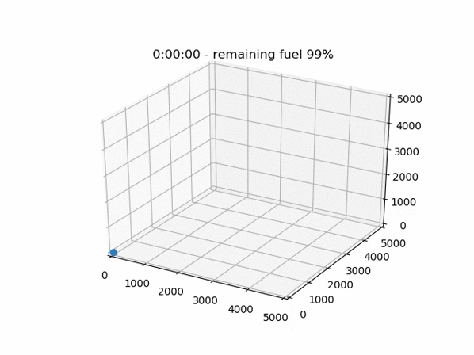
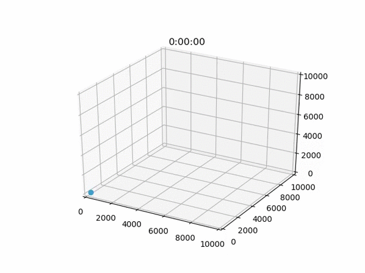

# Abstract

Consider a bot that given bot has 2 attributes. The average flight time (flight_time), and the average speed (speed). Trivially, we can assume that the average maximum distance the bot can travel is flight_time/speed.

For a given bot with a flight_time of 20 minutes, and a speed of 5 metres per second, we can assume the maximum distance 5*(20*60) = 6000 metres.

But what if you wish to fly the bot 10km? or 20km? What if you want to fly 10km and then maintain that position for an hour before returning 10km to the starting point? In these cases we have a clear energy deficit.

This project considers the scheduling of a dynamic in-flight refuelling system.

# Introduction
Introduction
This project is based in cartesian space
terminology: flight plan, waypoint, tower, bot, scheduler


## Flight plans
A flight plan is an object that represents the route, positioning, and actions to be performed by a bot.
In this project it can be read from a JSON object of the following format.

```json
{
   "id": "flight_plan_example_1",
   "bot_model": "GypsyMarkI",
   "starting_position":[0, 0, 0],
   "waypoints":[
      {
         "type":"leg",
         "cartesian_positions":{
            "from":[0, 0, 0],
            "to":[5000, 5000, 5000]
         }
      },
      {
         "type":"action",
         "action":"payload",
         "duration":1000
      },
      {
         "type":"leg",
         "cartesian_positions":{
            "from":[5000, 5000, 5000],
            "to":[0, 0, 0]
         }
      }
   ]
}
```
This flight plan represents a round trip which goes from a tower at 0,0,0 to 5000,5000,5000, waits there for 1000 seconds performing payload operations, and then returns the original tower.

We consider this as a two-third defined flight plan as it contains payload waypoint information, and the starting and ending tower, but it hasn't been processed to handle refuelling.

Note the bot model has been defined as part of the flight plan, because the flight plan is defined for a given payload, and we assume certain payloads will require certain bot models.

The simulation below shows the energy deficit for this flight plan:


To make this into fully defined flight plan, we need to consider the energy deficit, and then determine the solution.
Practically, we do this by considering the following variables:
- The charge time remaining when we want to perform the refuel (remaining_flight_time_at_refuel)
- The duration of the refuelling process (refuel_duration)

Then we process the waypoints and either inject refuelling waypoints between leg waypoints or overlay refuelling waypoints onto the action waypoints which results in a more fully defined flight plan.

If we define the following variables as such:
- remaining_flight_time_at_refuel = 300 seconds
- refuel_duration = 60
- bot_flight_time = 1000
- bot_speed = 20m/s

We end up with a recalculated flight plan resembling the following:
```json
{
   "waypoints":[
      {
         "cartesian_positions":{
            "from":[0, 0, 0],
            "to":[3695.150115473441, 3695.150115473441, 3695.150115473441]
         },
         "type":"leg",
         "id":"2da345e9-eb48-4e37-85ac-f8fcb4f72627"
      },
      {
         "type":"action",
         "action":"being_recharged",
         "duration":60,
         "id":"5fe6fb63-23de-4434-8786-091bdc594c2b"
      },
      {
         "cartesian_positions":{
            "from":[3695.150115473441, 3695.150115473441, 3695.150115473441],
            "to":[5000, 5000, 5000]
         },
         "type":"leg",
         "id":"cc71ee96-af8d-4d8a-894a-42046f53b215"
      },
      {
         "type":"action",
         "action":"payload",
         "duration":414,
         "id":"e69af01c-59bc-4246-90f8-e731e9990479"
      },
      {
         "type":"action",
         "action":"payload being_recharged",
         "duration":60,
         "id":"f9fbb31e-a194-47d9-92a7-5bd279d98a80"
      },
      {
         "cartesian_positions":{
            "from":[5000, 5000, 5000],
            "to":[1304.849884526559, 1304.849884526559, 1304.849884526559]
         },
         "type":"leg",
         "id":"6bd69de3-541b-42d1-ad3b-941a2108a625"
      },
      {
         "type":"action",
         "action":"being_recharged",
         "duration":60,
         "id":"da95bc01-3d7d-4cc7-9ae2-5ed2144ea495"
      },
      {
         "cartesian_positions":{
            "from":[1304.849884526559, 1304.849884526559, 1304.849884526559],
            "to":[0, 0, 0]
         },
         "type":"leg",
         "id":"765a74ab-23a6-4382-8dcd-3abc56a43700"
      }
   ],
   "bot_model":"GypsyMarkI",
   "starting_position":[0, 0, 0],
   "id":"flight_plan_example_2"
}
```

Which can be simulated as such (Note that the dotted lines means the a refuelling action is being performed on the bot)
GIF TIME

So at this point we have a fully defined flight plan which knows when and where it needs refuelling, but we have yet to determine the scheduling of these refuels

## Schedules
Given a fully defined flight plan, we need to determine all sub-flight plans for the refuelling bots, and potentially the sub-sub-flight plans to for refuelling refuel bots on a recursive basis.

??
??

Flight plan orchestration for payload carriers?

## Flexible Schedules
Not all flight plans are as simple to design as the aforementioned. Consider the client has payloads located at multiple towers. Their command could be as simple as "I want any one of these payloads, or a specific one of these payloads, at this position, at this time, for this duration".

In this case, we have to consider the sourcing of the payload, the transit of the payload, any in-between flight plans, and then the eventual flight plan.

Representing a command like this in JSON is not as simple due to the open-endedness of the request. So instead this is implemented in the scheduler class directly.

### Example 1
demo showing multiple towers

### Example 2
demo showing bots refueling eachother


### Example 3
demo showing multiple main bots creating a grid in space

# Core Logic
Core logic
